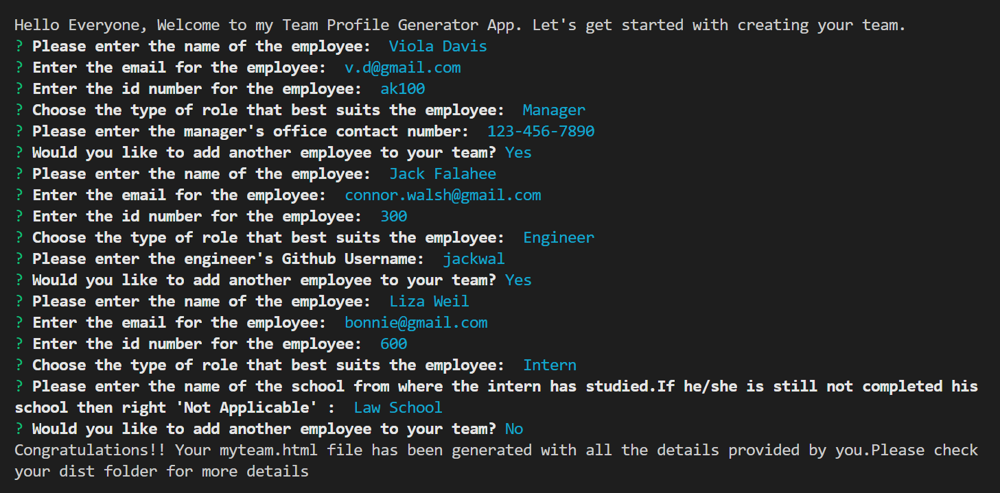
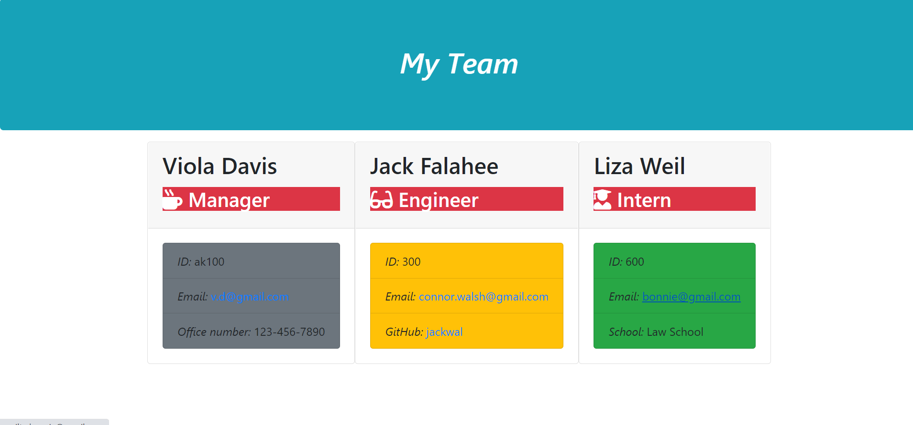

# TeamProfileGenerator_DR


An html file is generated based on the inputs provided

## Table of Contents
* [Introduction](#introduction)
* [Description](#description)
* [Screenshot of the questions](#scr)
* [Screenshot of the generated HTML Page](#scread)
* [Demo of the Application](#web)
* [Installations](#installations)
* [Questions](#ques)
* [Credits](#credits)

 ## Introduction 
I have built an index.js file that takes in information about an employee's team and then generates an HTML webpage. This page displays summaries for each person entered, namely, the _Manager_, the _Engineer_ and the _Intern_. 

## Description
Once the code is created, the user can initialize this application in the command line. It will work once you run the following commands

```
npm install
```
The application will begin by typing the following command in the terminal and pressing the "enter" key:
```
node index
```

  *I have created various folders/directories that contain all the necessary files*.
  *  Namely, the __tests__ folder contanis all the tests.js files for the employees.
  *  The __lib__ folder has all the js files.
  *  __src__ folder contains the html files for the app, while the __dist__ folder will hold the generated html page.
  
  *The code functions as per the following commands*.
  *  The user is asked if he wants to clear the old html (if any) that had been generated by running the code before.
  *   On entering a yes for the same, the user is then greeted  with a welcome message and is required to answer the questions based on the options provided to him.
  *    All the three have some common questions to answer like the Manager, the engineer and the Intern are required to enter  their __names__, __ID's__ and __email's__.
  *    Apart from that,the intern requires the user to input their school name,and the engineer requires to input the github username.
  *    An HTML file is thus updated/generaated based on the inputs rpovided by the user. The figures below show the screenshotsof the questions and the generated Web page.

 
 ## Screenshot of the questions
 
 
 ## Screenshot of the README
 

 ## Demo of the Application
 The following video shows how I created this app and how it generates the file. I may make some changes to the code to make it more clean. But more or less, it is almost an exact representation of the code

 [The Youtube Link]()
 
 
 ## Installations
   [The URL of the Github repo](https://github.com/Dipti2021/TeamProfileGenerator_DR)
   

 ## Questions
In case of any questions, contact me through any of the following methods:
 * If you want you can [open an issue](https://github.com/Dipti2021/TeamProfileGenerator_DR/issues) and let me know about it.
 * You can contact me on [my  mail id](mailto:dipti.raina@gmail.com) and discuss the problems that you might have faced or even if you want to add on something to the code.


    
 ## Credits
    The homework has been assigned to me by the Carleton University Coding Bootcamp, our instructor and the TA's

